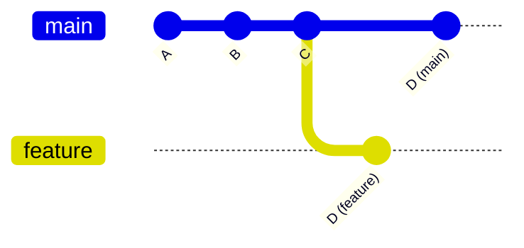

# 🔀 Git checkout 기능 정리

## 1. checkout이란?
- **브랜치 전환** 또는 **특정 커밋 상태로 이동**하는 명령어
- 코드 작업 시 다른 흐름(브랜치/커밋)으로 자유롭게 이동할 수 있음


- git checkout feature → feature 브랜치로 이동 후 작업
- git checkout main → 다시 main 브랜치로 이동
- 브랜치마다 다른 작업 흐름이 독립적으로 이어짐

---

## 2. 주요 쓰임새

### 1) 브랜치 전환
```bash
git checkout main
git checkout feature/login
```
- 작업 브랜치를 바꾸고 싶을 때 사용

### 2) 새 브랜치 생성 + 이동
```bash
git checkout -b feature/signup
```
- feature/signup 브랜치를 만들고 바로 이동

### 3) 특정 커밋으로 이동 (detached HEAD 상태)
```bash
git checkout <commit_hash>
```
- 과거 특정 커밋 시점의 코드를 확인하고 싶을 때
- 단, 이 상태에서 작업 후 커밋하면 브랜치와 연결되지 않음(주의)

---

## 3. 실무 예시
- 버그 수정 전환: main에서 git checkout -b hotfix/issue-101 → 긴급 수정
- 기능 작업 시작: develop에서 git checkout -b feature/payment
- 히스토리 확인: 특정 버전(커밋 해시)으로 checkout 후 코드 비교

---

## 4. 요약
- checkout = 브랜치 전환 + 커밋 시점 이동
- 새 브랜치를 만들 때 -b 옵션 자주 사용
- 특정 커밋 checkout은 “읽기 전용 확인” 목적이 많음 (detached HEAD 주의)
