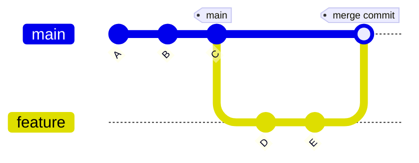
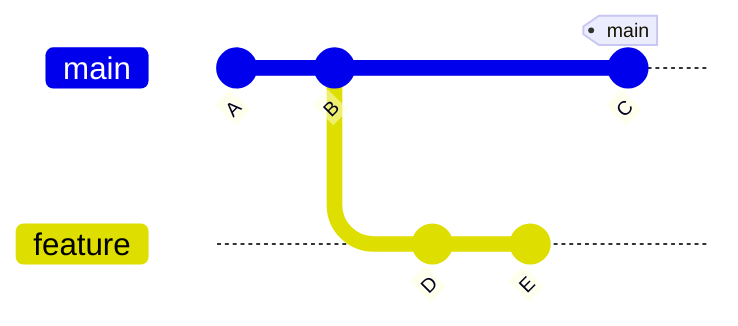
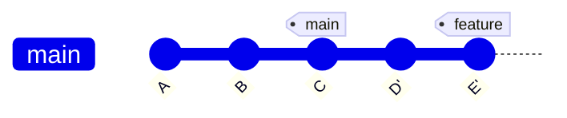

# 🔀 Git Merge vs Rebase

## 1. merge (병합)

### 💬 개념
- 현재 브랜치(예: main)로 다른 브랜치(B)의 커밋들을 **합쳐서 새로운 merge commit**을 만든다.  
- 히스토리에는 분기와 합쳐진 흔적이 그대로 남는다.  

### 💬 명령어
```bash
git checkout main
git merge feature    // feature 브랜치 커밋 내용들을 main으로 병합시키기.
git branch -d add-coach    // add-coach 브랜치 삭제하기.
```

#### -d 옵션: safe delete
- 해당 브랜치가 이미 현재 브랜치(main)에 병합된 경우에만 삭제됩니다.
- 병합이 안 된 상태라면 Git이 경고를 띄우고 삭제하지 않음.

#### -D 옵션: force delete
- 병합 여부 상관없이 강제로 브랜치를 삭제합니다.
- 위험할 수 있어서 보통 -d를 먼저 씁니다.


### 💬 시각화


---

## 2. rebase (재배치)
### 개념

- 현재 브랜치(예: feature)에 있는 커밋들을 다른 브랜치(main)의 끝으로 옮겨 쌓는다.

- 히스토리가 일직선으로 정리되며, merge commit이 생기지 않는다.

- 기존 커밋이 새로 다시 작성되므로(해시 변경), 협업 시에는 주의해야 한다.

### 💬 명령어
```css
git checkout feature
git rebase main
```

### 💬 rebase 전


### 💬 rebase 후


---

## ✅ 차이 정리

| 구분     | git merge 브랜치명                          | git rebase 브랜치명                       |
|----------|-------------------------------|-------------------------------|
| 히스토리 | 분기와 합쳐진 흔적 보존        | 일직선으로 정리됨             |
| Commit   | merge commit 생성              | 커밋 재작성 (새 해시 부여)    |
| 안전성   | 협업에 안전                    | 공유 브랜치에서 쓰면 위험     |
| 장점     | 추적이 명확                    | 로그가 깔끔                   |
| 단점     | merge commit 누적 가능         | 기존 커밋 해시 변경           |

---

### 🔀 git merge

#### 언제?

- 협업 환경에서 각자 만든 브랜치를 메인(main/dev) 브랜치에 합칠 때

- 팀원이 작업한 “흔적(분기/합류)”을 히스토리에 그대로 남기고 싶을 때

#### 특징

- 히스토리에 merge commit이 남음 → 추적이 명확

- 브랜치 히스토리가 복잡해질 수 있음

### 🔁 git rebase

#### 언제?

- 개인 작업(feature 브랜치)에서 main 최신 상태 위로 내 커밋을 깔끔히 다시 쌓고 싶을 때

- 히스토리를 직선으로 정리해서 보기 좋게 만들고 싶을 때

#### 특징

- 커밋 해시가 바뀜 → 공유 브랜치에는 위험

- 혼자 작업 중일 때 쓰면 깔끔한 로그 관리 가능

## 🔑 핵심 요약
- **merge**: 브랜치 흐름을 보존하며 합침 → “역사 기록 중시”  
- **rebase**: 브랜치를 일직선으로 정리 → “깔끔한 로그 중시”  
