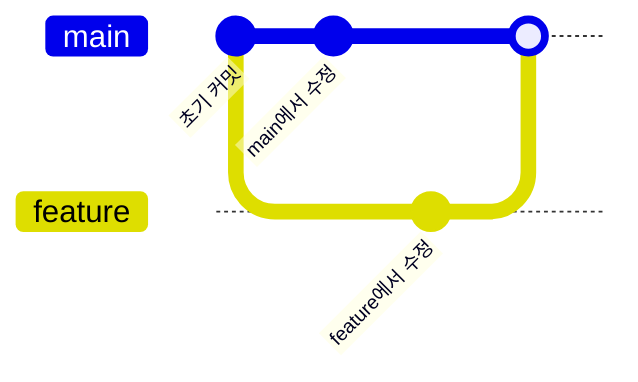
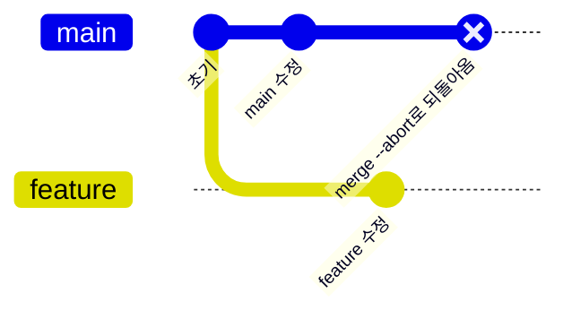
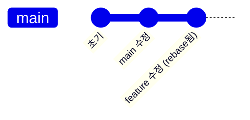
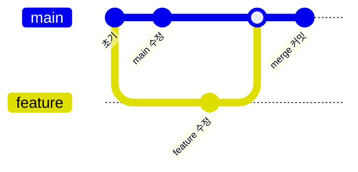
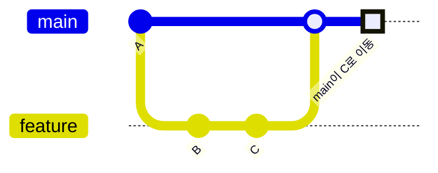

# Git 충돌 문제 해결 가이드

## 결론
**브랜치 2개에서 같은 파일 같은 줄을 수정하면 merge 시 충돌 발생. 충돌 표시자 확인 후 원하는 내용으로 수정하고 커밋.**

---

## 충돌 발생 상황



같은 파일의 같은 줄을 두 브랜치에서 다르게 수정 → merge 시 충돌

---

## 기본 충돌 해결

### 1. 충돌 확인
```bash
git merge feature
# CONFLICT (content): Merge conflict in file.txt

git status
# both modified: file.txt
```

### 2. 충돌 내용 확인
```
<<<<<<< HEAD
main 브랜치 내용
=======
feature 브랜치 내용
>>>>>>> feature
```

### 3. 해결 방법 선택

**A. main 브랜치 내용 선택:**
```bash
git checkout --ours file.txt
git add file.txt
git commit
```

**B. feature 브랜치 내용 선택:**
```bash
git checkout --theirs file.txt
git add file.txt
git commit
```

**C. 직접 수정:**
```bash
# 파일 편집 후
git add file.txt
git commit
```

---

## --abort 기능

### Merge 취소
```bash
git merge feature
# 충돌 발생
git merge --abort
# merge 이전 상태로 되돌림
```



### Rebase 취소
```bash
git rebase main
# 충돌 발생
git rebase --abort
# rebase 이전 상태로 되돌림
```

---

## Rebase 충돌 해결

### 1. Rebase 시도
```bash
git checkout feature
git rebase main
# CONFLICT (content): Merge conflict in file.txt
```

### 2. 충돌 해결 후 계속
```bash
# 파일 수정 후
git add file.txt
git rebase --continue
```



### Rebase vs Merge 결과 비교

**Merge 결과:**


**Rebase 결과:**


---

## Main 브랜치를 최신으로 이동

### Fast-forward merge
```bash
git checkout main
git merge feature
# main이 feature의 최신 커밋으로 이동
```



---

## 실행 체크리스트

- [ ] `git status`로 충돌 파일 확인
- [ ] 충돌 표시자 `<<<<<<<`, `=======`, `>>>>>>>` 제거
- [ ] `git add .` 스테이징
- [ ] `git commit` 또는 `git rebase --continue`

## 주요 명령어

```bash
# 충돌 상태 확인
git status

# 충돌 해결 후
git add .
git commit  # merge인 경우
git rebase --continue  # rebase인 경우

# 취소하기
git merge --abort
git rebase --abort
```
