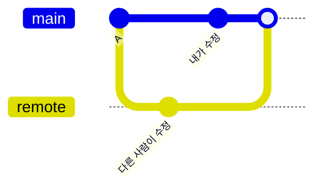
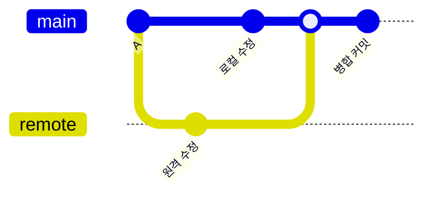
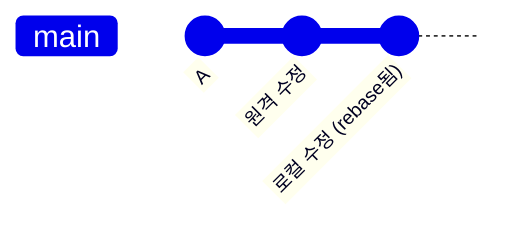

# 📌 GitHub 계정 설정부터 충돌 해결까지 완전 가이드

## 결론
**GitHub 계정 생성 → Token 발급 → 터미널 연동 → 레파지토리 생성 → Cursor 연동 → pull/push 작업 → 충돌 해결까지 한 번에 완료.**

---

## 1. GitHub 계정 및 Token 설정

### GitHub 계정 생성
1. [github.com](https://github.com) 접속
2. Sign up 클릭
3. 이메일, 비밀번호, 유저네임 입력

### Personal Access Token 생성
1. GitHub 로그인 → 우측 상단 프로필 → Settings
2. 좌측 메뉴 → Developer settings → Personal access tokens → Tokens (classic)
3. Generate new token (classic) 클릭
4. **설정 항목:**
   - Note: `cursor-terminal-access`
   - Expiration: `90 days`
   - 권한 선택: `repo`, `workflow`, `write:packages`
5. Generate token 클릭
6. **생성된 토큰 복사 후 안전한 곳에 저장**

### 터미널에서 GitHub 연동
```bash
# Git 사용자 정보 설정
git config --global user.name "your-username"
git config --global user.email "your-email@example.com"

# 토큰 저장 (첫 push 시 Username에 깃허브아이디, Password에 토큰 입력)
git config --global credential.helper manager
```

- Mac에서는 아래 사진과 같이 자동으로 설정됨.


---

## 2. 레파지토리 생성 및 Cursor 연동

### GitHub에서 레파지토리 생성
1. GitHub 메인페이지 → New repository
2. Repository name: `my-project`
3. Public/Private 선택
4. Add README file 체크
5. Create repository 클릭

### Cursor에서 프로젝트 시작
```bash
# 터미널에서 프로젝트 폴더 생성
mkdir my-project
cd my-project

# Git 초기화
git init

# GitHub 레파지토리 연결
git remote add origin https://github.com/your-username/my-project.git

# 원격 레파지토리 내용 가져오기
git pull origin main

# Cursor에서 프로젝트 열기
cursor .
```

### 첫 번째 push 테스트
```bash
# 파일 생성
echo "# My Project" > test.md

# 스테이징 및 커밋
git add .
git commit -m "첫 번째 커밋"

# 원격 레파지토리에 푸시
git push origin main
# Username: your-github-username
# Password: your-personal-access-token
```

---

## 3. 일반적인 작업 플로우

### Pull → 작업 → Push 사이클
```bash
# 1. 최신 상태로 업데이트
git pull origin main

# 2. Cursor에서 코드 작업

# 3. 변경사항 확인
git status
git diff

# 4. 커밋
git add .
git commit -m "기능 추가: 로그인 페이지"

# 5. 원격 레파지토리에 푸시
git push origin main
```

- 레파지토리 생성 후 아래와 같은 명령어가 있음. 이걸 복사해서 터미널에 붙여 넣으면 push, pull 시, '-u origin main'까지 쓸 필요가 없어짐.


---

## 4. 충돌 해결 방법

### 충돌 발생 상황


### 충돌 해결 과정
```bash
# pull 시 충돌 발생
git pull origin main
# CONFLICT (content): Merge conflict in file.txt

# 충돌 파일 확인
git status
# both modified: file.txt

# Cursor에서 충돌 파일 열기 (충돌 표시자 확인)
```

**충돌 파일 내용:**
```
<<<<<<< HEAD
내가 수정한 내용
=======
다른 사람이 수정한 내용
>>>>>>> origin/main
```

**해결 방법:**
1. **Cursor에서 충돌 표시자 제거**
2. **원하는 내용으로 수정**
3. **저장 후 커밋**

```bash
# 해결 후 스테이징
git add .
git commit -m "충돌 해결: 코드 병합"
git push origin main
```

---

## 5. Pull 옵션의 차이점

### `git pull` (기본값)
```bash
git pull origin main
```
- **동작**: fetch + merge
- **결과**: 병합 커밋 생성



### `git pull --no-rebase`
```bash
git pull --no-rebase origin main
```
- **동작**: 명시적으로 merge 사용
- **결과**: 위와 동일 (병합 커밋 생성)

### `git pull --rebase`
```bash
git pull --rebase origin main
```
- **동작**: fetch + rebase
- **결과**: 선형 히스토리



---

## 6. 권장 설정 및 체크리스트

### Git 기본 설정
```bash
# pull 기본 동작을 rebase로 설정 (선택사항)
git config --global pull.rebase true

# 기본 브랜치 이름을 main으로 설정
git config --global init.defaultBranch main
```

### 작업 전 체크리스트
- [ ] `git pull origin main`으로 최신 상태 확인
- [ ] Cursor에서 코드 작업
- [ ] `git status`로 변경사항 확인
- [ ] `git add .` → `git commit -m "메시지"`
- [ ] `git push origin main`

### 충돌 해결 체크리스트
- [ ] 충돌 파일에서 `<<<<<<<`, `=======`, `>>>>>>>` 모두 제거
- [ ] 원하는 내용으로 수정 완료
- [ ] `git add .` → `git commit`
- [ ] `git push origin main`

---

## 7. 자주 사용하는 명령어

```bash
# 상태 확인
git status
git log --oneline

# 원격 레파지토리 정보
git remote -v

# 브랜치 확인
git branch -a

# 변경사항 되돌리기
git checkout -- file.txt  # 작업 중인 파일 되돌리기
git reset HEAD~1           # 마지막 커밋 취소
```

---

## 다음 액션

1. **GitHub 계정 생성 및 토큰 발급**
2. **테스트 레파지토리로 연동 실습**
3. **Cursor와 터미널 연동 확인**
4. **의도적 충돌 상황 만들어서 해결 연습**
5. **팀 작업 시 브랜치 전략 수립**
