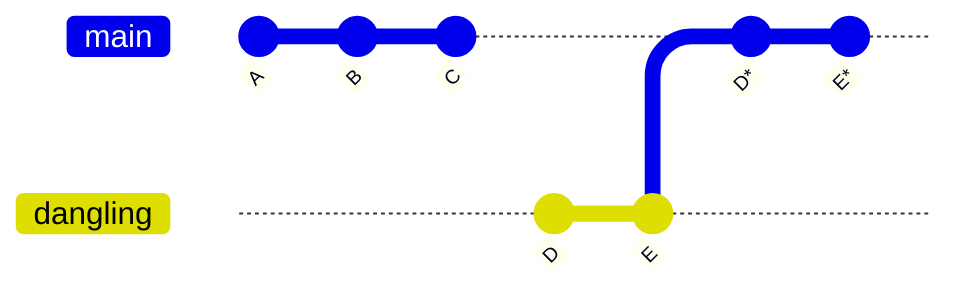

# Git Reset 학습 정리

## 📌 핵심 개념

### Git Reset의 동작
- `git reset --hard 커밋해시`: 지정된 커밋으로 이동하면서 작업 디렉토리도 해당 커밋 상태로 변경
- `git reset --hard` (생략형): `git reset --hard HEAD`와 동일, 현재 커밋 상태로 작업 디렉토리 정리

### .git 폴더의 역할
- Git의 모든 메타데이터 저장 (커밋 히스토리, 브랜치 정보 등)
- 실제 작업 디렉토리 파일들과는 완전히 분리됨
- .git 복원 = 히스토리만 복원, 파일 시스템은 건드리지 않음


### reset (전체 지우개)



- git reset --hard C → 브랜치 포인터가 C로 이동
- 이후 커밋 D, E는 사라지고, 새로운 D*, E*를 다시 쌓음

---

## 📌 실습에서 발견한 현상

### 상황
1. n번째 커밋 상태에서 `git reset --hard First_Commit`으로 되돌림
2. 복사해둔 .git 폴더로 복원
3. **결과**: lions.yaml이 untracked 상태로 남아있음

### 원인 분석
- **Git 히스토리**: .git 복원으로 최신 커밋까지 모두 복원됨
- **작업 디렉토리**: reset 했을 때 상태 그대로 유지됨 (First Commit 상태)
- **불일치 발생**: HEAD는 최신 커밋, 작업 디렉토리는 First Commit 상태

### 왜 이런 현상이 발생할까?

#### 커밋 히스토리 예시
```
First Commit: lions.yaml, tigers.yaml 추가
Replace Lions with Leopards: lions.yaml 삭제, leopards.yaml 추가
Add Goerge To Tigers: tigers.yaml 수정
Add team Cheetas: cheetas.yaml 추가
Replace Cheetas with Panthers: cheetas.yaml 삭제, panthers.yaml 추가
```

#### 실습 과정
```
최신 커밋 상태 (panthers.yaml, leopards.yaml, tigers.yaml)
↓ git reset --hard First_Commit
First Commit 상태 (lions.yaml, tigers.yaml, .gitignore)
↓ .git 폴더 복원
히스토리: 최신 커밋 / 작업 디렉토리: First Commit 상태
```

<br>

## 📌 Git의 데이터 보호 철학

### 왜 자동으로 정리하지 않을까?

**Git의 안전 우선 설계:**
- reset 후 사용자가 중요한 작업을 했을 수 있음
- .git 복원이 자동으로 파일을 변경하면 사용자 작업이 손실될 수 있음
- **"데이터 손실보다는 불일치가 낫다"**는 철학

### 구체적인 보호 시나리오
```
사용자가 reset 후에:
- A 파일을 중요하게 수정함 ⭐
- 새로운 E 파일을 만듦 ⭐
→ .git 복원 시 이런 작업들이 보존됨
```

### 보존 원칙
- **.git 복원 시점의 작업 디렉토리 상태를 그대로 보존**
- reset을 몇 번 했든, 커밋을 몇 번 했든 상관없음
- 항상 **"현재 작업 디렉토리에 뭐가 있느냐"**만 고려

<br>

## 📌 다양한 시나리오 예시

### 시나리오 1: 단순한 경우
```
n번째 커밋 → reset 1번째 → .git 복원
→ 1번째 커밋 파일들이 untracked로 남음 ✅
```

### 시나리오 2: 여러 번 reset
```
n번째 커밋 → reset 1번째 → reset 5번째 → reset 3번째 → .git 복원
→ 3번째 커밋 파일들이 untracked로 남음
```

### 시나리오 3: 복잡한 경우
```
커밋1 - 커밋2 - reset1회 - 커밋3 - 커밋4 - 커밋5 - reset2회 - 커밋6 - .git복원
→ 커밋6 상태 파일들이 보존됨
```

<br>

## 📌 해결 방법

**.git 복원 후 작업 디렉토리 정리:**
```bash
git reset --hard HEAD  # 또는 git reset --hard
```

**동작:**
- 작업 디렉토리를 현재 HEAD 커밋 상태와 일치시킴
- untracked 파일들은 삭제
- missing 파일들은 복원

**결과 예시:**
```
복원 전:
- lions.yaml: untracked (있으면 안 되는 파일)
- leopards.yaml, panthers.yaml: missing (있어야 하는 파일)

git reset --hard 후:
- lions.yaml: 삭제됨
- leopards.yaml, panthers.yaml: 복원됨
```

<br>

## 📌 핵심 포인트 정리

1. **분리된 구조**: .git = 메타데이터, 작업 디렉토리 = 실제 파일들
2. **안전 우선**: Git은 사용자 작업을 보호하기 위해 파일을 자동 변경하지 않음
3. **현재 상태 보존**: .git 복원은 현재 작업 디렉토리 상태를 그대로 유지
4. **수동 정리**: 불일치 해결은 사용자가 `git reset --hard`로 직접 수행

<br>

## 📌 배운 점

이번 학습을 통해 Git의 **안전장치**에 대해 깊이 이해할 수 있었습니다. 처음엔 "왜 삭제된 파일이 나타나지?"라고 의문을 가졌지만, Git이 사용자의 소중한 작업을 보호하기 위한 설계라는 걸 알게 되었습니다.

**Git의 철학: "실수로 데이터를 잃는 것보다, 약간의 불편함이 낫다"** 🛡️
