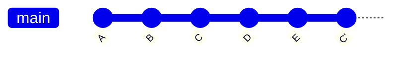

# 🔄 Git Revert 기능 정리

## 1. Revert란?
- 특정 커밋에서 적용된 변경사항을 **되돌리되, 새로운 커밋으로 기록**하는 기능  
- 원본 커밋은 그대로 남고, 반대 변경을 추가 커밋으로 쌓는 방식  
- 협업 환경에서 안전하게 과거 변경을 취소할 때 사용


- git revert C → C의 변경사항을 취소하는 C' 커밋이 새로 추가
- D, E는 그대로 유지됨

💡 핵심: 작업 C, D, E 내용은 히스토리에 그대로 보존된채, C작업 내용만 지워진 새로운 C'를 작업하게 됨.

---

## 2. 특징
- **히스토리 보존**: 기존 커밋은 삭제되지 않음  
- **안전성**: 원격 저장소와 충돌 위험이 적음  
- **새로운 커밋 생성**: `reset`과 달리 되돌린 기록이 남음  

---

## 3. 사용 예시

### 단일 커밋 되돌리기
```bash
git revert <commit_hash>
```

---

## 여러 커밋 되돌리기
```bash
git revert <hash1> <hash2>
```

## 충돌 발생 시
```bash
git add .
git revert --continue
```

---

## 4. Reset과의 차이
| 기능            | revert            | reset              |
|-----------------|------------------|--------------------|
| 기록 보존       | ✅ 유지           | ❌ 사라질 수 있음 |
| 협업 안정성     | ✅ 안전           | ⚠️ 위험           |
| 되돌리는 방식   | 반대 커밋 생성   | 히스토리 자체 변경 |
